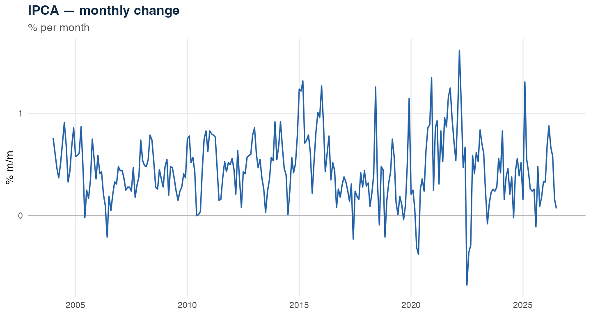
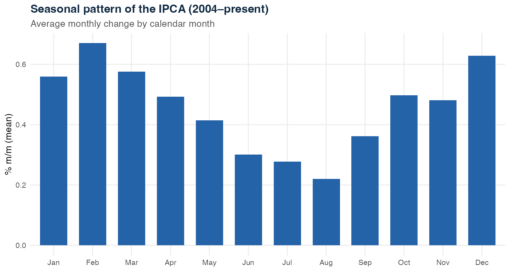
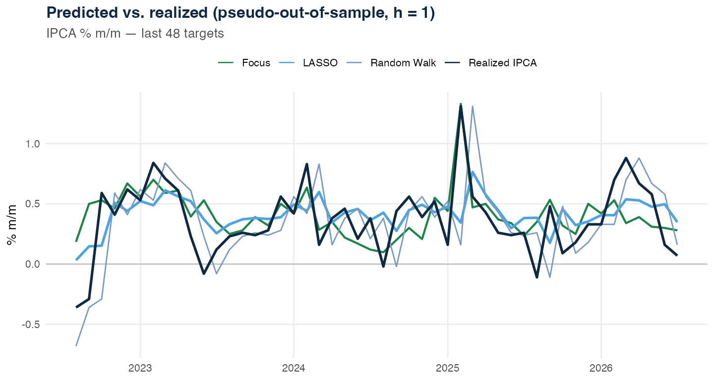
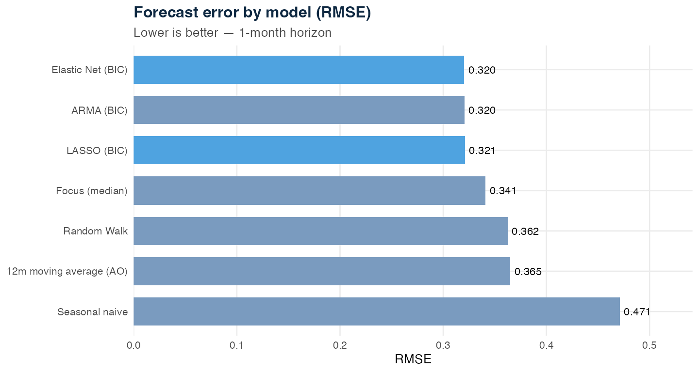
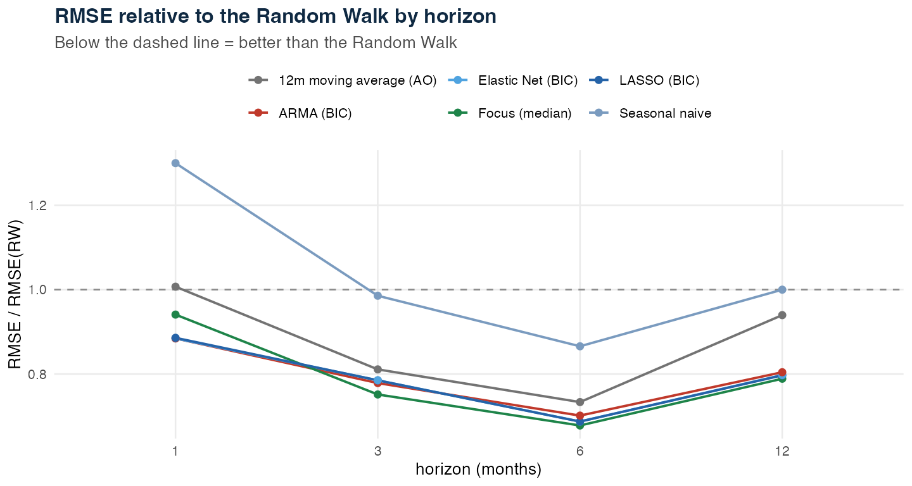
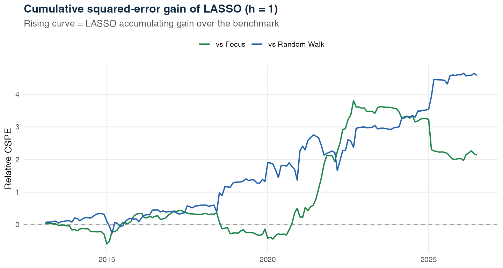
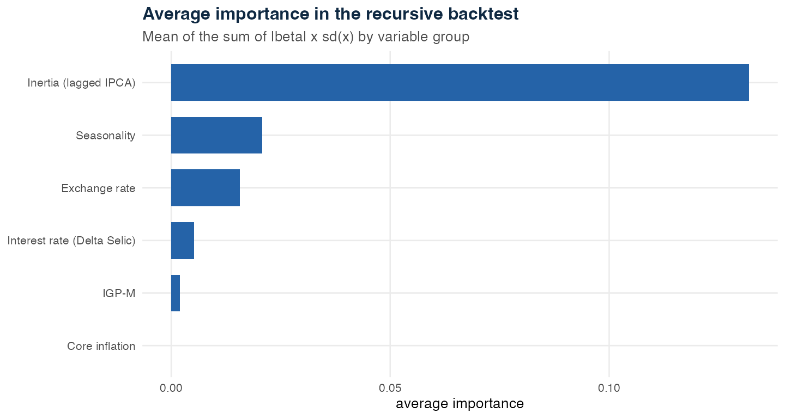
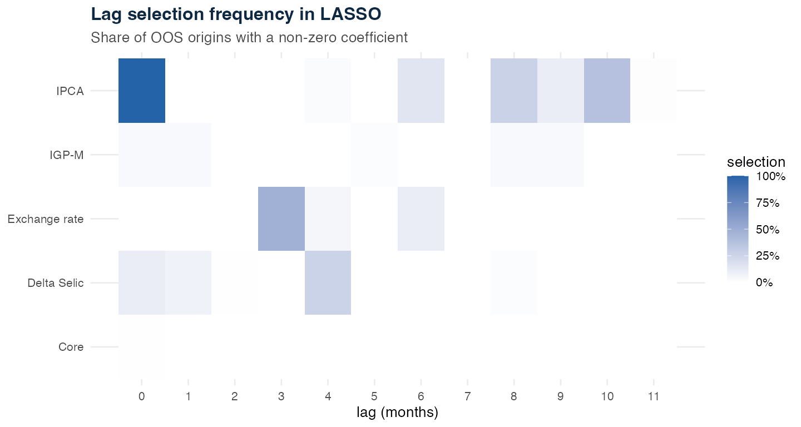

# Can machine learning keep up with the market on Brazilian inflation?

### A reproducible study with LASSO and Elastic Net, BIC tuning, and a time-respecting out-of-sample evaluation

*Pedro Bragança*

---

Forecasting Brazilian inflation month by month is hard. The IPCA combines inertia, seasonality, and shocks from the exchange rate, food, and administered prices. So the relevant question is not whether a sophisticated model can fit history well, but whether it **improves a genuinely out-of-sample forecast** — and how it stacks up against the reference that actually matters in Brazil: the market consensus.

In this exercise I compare LASSO and Elastic Net against five references: a Random Walk, the average of the last 12 monthly changes in the spirit of Atkeson–Ohanian, a seasonal naïve rule, an ARMA re-selected at each origin by BIC, and — the hardest of all — the median of the **Focus** market-expectations survey. The evaluation runs across four horizons (1, 3, 6, and 12 months). Figures cited in the text refer to h = 1 unless stated; the cross-horizon comparison is in Section 6. The h = 1 evaluation covers **162 forecasts**, produced at origins from Jan 2013 to Jun 2026, for targets from Feb 2013 to Jul 2026.

The methodology is inspired by Araujo & Gaglianone (Banco Central do Brasil, Working Paper 561, 2022), but uses a deliberately small set of variables to keep the exercise transparent and reproducible on entirely public data.

> **Scope.** This is a personal, reproducible methodological study built on public data. It is a retrospective forecast-evaluation exercise — not identification of causal effects, and not a forecast of future inflation. Coefficients and importance measures indicate predictive power, not structural effects on inflation.

---

## 1. The question and the benchmarks

The basic rule of a forecasting *horse race* is simple: complexity is only justified when it improves out-of-sample performance. That is why LASSO and Elastic Net are compared against five benchmarks:

- **Random Walk:** next month's inflation equals the inflation observed in the current month;
- **Atkeson–Ohanian:** the forecast is the average of the last 12 monthly IPCA changes;
- **Seasonal naïve:** the forecast is the inflation observed in the same month of the previous year;
- **ARMA:** the autoregressive dynamics are re-estimated at each forecast origin and its order is selected by BIC using only the information available at that moment;
- **Focus:** the median of the market's IPCA expectations for the target month, taken as the most recent projection known at the forecast origin.

The seasonal naïve benchmark matters here: if the analysis itself identifies monthly seasonality in the IPCA, the benchmark must let a very simple rule exploit that pattern. The Focus is the gold standard: in Brazilian inflation, a model is only interesting if it comes close to market expectations — beating the Random Walk is the floor, not the goal.

---

## 2. The data

The data come from the Time Series Management System (SGS) and the Market Expectations (Focus) survey of the Banco Central do Brasil — all public. I use the monthly IPCA as the target and four blocks of macroeconomic information:

| Series | SGS code | Use |
|---|---:|---|
| IPCA — monthly change | 433 | target and lags |
| BRL/USD exchange rate | 3698 | log change |
| Selic policy rate (monthly) | 4189 | first difference |
| IGP-M | 189 | predictor |
| IPCA core — trimmed means (smoothed) | 4466 | predictor |

The final matrix has **71 candidate predictors**: 12 lags of each of the five predictive blocks — including the IPCA itself — plus 11 monthly dummies. The Focus median enters separately, via the Olinda Market Expectations API, as a real-time benchmark.

The Selic enters in **first difference**, not simultaneously in level and change. The exchange rate enters in log change. These transformations avoid carrying potentially non-stationary levels into a regression whose goal is monthly inflation forecasting.

---

## 3. Seasonality and specification

Before estimating the models, I check stationarity with ADF/Phillips–Perron and KPSS and assess seasonality with monthly dummies. For the joint inference on the dummies, I also use a HAC/Newey–West covariance matrix, appropriate to possible autocorrelation and heteroskedasticity in monthly residuals.

Seasonality enters prospectively: the dummy corresponds to the **month being forecast**, not the month in which the forecast is produced. The distinction looks small at a one-month horizon, but it avoids an interpretation shift and leaves the structure ready to extend to longer horizons.

---

## 4. LASSO and Elastic Net: why change the tuning

LASSO estimates a linear regression with an L1 penalty. The penalty shrinks coefficients and can zero out predictors that add little. Elastic Net combines L1 and L2 penalties and tends to handle groups of correlated variables better.

Hyperparameter selection is a decisive point in time series. A traditional K-fold splits the sample into random blocks and can use chronologically later observations to validate models estimated on earlier ones. That is inappropriate for a forecasting exercise.

So in this version **λ is selected by BIC within each training window**. In Elastic Net, the pair `(α, λ)` is also chosen by the lowest BIC. This choice follows the logic Araujo & Gaglianone adopt for penalized regressions in their IPCA forecasting exercise. In other words: the tuning also respects the information set available at each origin.

---

## 5. The backtest

The validation is pseudo-out-of-sample and uses an **expanding window**. At each origin `t`:

1. I estimate the models using only earlier observations;
2. I select the hyperparameters by BIC within that sample;
3. I produce the IPCA forecast at `t+h`, for each horizon `h ∈ {1, 3, 6, 12}` via the direct approach;
4. I move one month forward and repeat.

I also separate two dates explicitly in the code:

- `origin_date`: the month in which the forecast is produced;
- `target_date`: the month of the IPCA being forecast.

This corrects the one-month shift that can appear when the target is built with `lead(IPCA, h)` but the chart keeps using the origin date.

One limitation remains: I assume the macro series referring to month `t` are available to forecast `t+h`. So, for the macro predictors, the exercise is **not yet a real-time / vintage backtest** — though the Focus, carrying each survey's date, already enters in real time.

---

## 6. Out-of-sample results

The RMSE table from the backtest (h = 1) is:

| Model | RMSE |
|---|---:|
| LASSO (BIC) | {{RMSE_LASSO}} |
| Elastic Net (BIC) | {{RMSE_EN}} |
| ARMA (BIC) | {{RMSE_ARMA}} |
| Seasonal naïve | {{RMSE_SRW}} |
| 12-month average (AO) | {{RMSE_AO}} |
| Focus (median) | {{RMSE_FOCUS}} |
| Random Walk | {{RMSE_RW}} |

The picture changes across horizons. The chart below shows each model's RMSE relative to the Random Walk for 1, 3, 6, and 12 months: below the dashed line, the model beats the Random Walk. The Focus tends to be the lowest reference — the hardest to reach — and the interest is in how close LASSO and Elastic Net get to it, especially at the longer horizons, where the macro predictors have more room to add over pure inertia.

Against the Random Walk, LASSO shows an RMSE gain of **{{GAIN_LASSO_RW}}%** at h = 1. The more important point, though, is not to look only at the point difference in RMSE.

The Diebold–Mariano test for LASSO against the Random Walk gives `p = {{DM_RW_P1}}` in the pre-specified one-sided test and `p = {{DM_RW_P2}}` two-sided. Against Atkeson–Ohanian, the respective p-values are `{{DM_AO_P1}}` and `{{DM_AO_P2}}`; against the seasonal naïve, `{{DM_SRW_P1}}` and `{{DM_SRW_P2}}`; against the ARMA, `{{DM_ARMA_P1}}` and `{{DM_ARMA_P2}}`; and against the Focus, `{{DM_FOCUS_P1}}` and `{{DM_FOCUS_P2}}`.

The correct interpretation is not "the probability the result is luck is x%." The test asks whether the observed errors are consistent with **equal predictive accuracy**, given its assumptions. Where the difference against the Focus is small or not significant, the honest reading is that the model is *competitive with the market consensus*, not that it decisively beats it.

---

## 7. Is the gain stable over time?

An aggregate RMSE can hide an important story. A model may win during a few extreme episodes and tie with the benchmark over the rest of the sample.

So I compute the cumulative squared-error gain of LASSO against the Random Walk and against the Focus. When the curve rises, LASSO is accumulating an advantage; when it falls, the benchmark is regaining ground.

This figure shows **when** the predictive gain arises — and whether it depends excessively on specific periods, such as bouts of accelerating inflation or exchange-rate shocks. The comparison against the Focus is the most informative: it shows in which episodes the model actually keeps up with market expectations.

---

## 8. What the model selects

Interpreting LASSO coefficients requires care. Summing the raw magnitudes of coefficients measured on different scales does not produce a comparable importance measure. In this version, for each predictor `j` and each backtest origin, I use a measure proportional to `|β_j| × sd(x_j)`. That puts each coefficient's contribution on a comparable scale. I then aggregate importance across the recursive estimations.

There is a second, equally important question: **is the variable selected stably?** To answer it, I compute the frequency with which each lag receives a non-zero coefficient across the out-of-sample origins.

This chart is a more defensible way to discuss inertia, interest rates, or exchange-rate pass-through. If specific exchange-rate lags appear recurrently, that is evidence of predictive stability. If they show up only in the full-sample fit, the interpretation must be more cautious.

---

## 9. What this exercise allows — and what it does not

The revised design improves four important aspects of the exercise: the tuning does not use random K-fold, the benchmarks are more demanding (including the Focus), the target date is explicitly separated from the origin, and variable importance is computed on a comparable scale across the backtest.

This makes the conclusion narrower — and, precisely for that reason, more defensible. The result holds for **this sample, this predictor set, this expanding window, and these four horizons**. There is no reason to turn a win in one specific horse race into a claim of universal ML superiority.

The main limitations remain:

- **No vintages for the macro predictors:** I use the latest available information in the SGS, not the data as it was known at each historical date. This gives the models a mild informational edge over the Focus, whose respondents saw only the data available at each survey date — so the model-vs-Focus comparison is, if anything, tilted slightly in the models' favor. A real-time replication is the natural next step.
- **Few predictors:** the exercise is intentionally smaller than the reference study, which uses a much broader database.
- **Direct forecasting by horizon:** each horizon is estimated independently, without forecast combination.
- **Possible structural breaks:** a rolling window may outperform the expanding one in some regimes.

---

## 10. Conclusion

The main lesson is not that "machine learning wins." It is that **a regularized model must beat simple benchmarks — and keep up with the market consensus — under a validation protocol that respects time.**

In the revised specification, the quantitative ranking and the tests above show exactly where LASSO and Elastic Net stand relative to the Random Walk, the Atkeson–Ohanian benchmark, the seasonal naïve, a traditional ARMA, and — the hardest test — the Focus median, across four horizons. The CSPE analysis shows *when* the gain appears; the selection frequency shows whether the economic narrative about the predictors is stable over time.

The natural next step is to move to real-time vintages for the macro predictors and to experiment with forecast combinations — for example, an average of LASSO, ARMA, and the Focus. That would bring the horse race even closer to the problem faced by anyone producing inflation forecasts in real time.

---

*Data sources: Banco Central do Brasil / SGS and the Focus market-expectations survey (Olinda API). Methodological reference: Araujo, G. S. and Gaglianone, W. P. (2022), "Machine Learning Methods for Inflation Forecasting in Brazil: new contenders versus classical models", Banco Central do Brasil, Working Paper 561. Personal study on public data; views are the author's own.*
